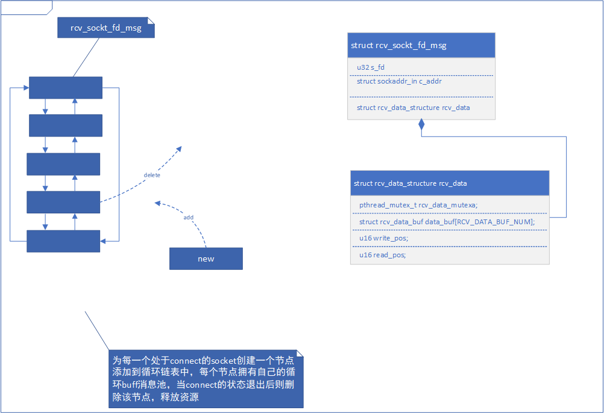

# socket-tool
socket的测试工具，目前支持TCP/UDP的服务端和客户端采用多线程加速，TCP服务端最大接收6路客户端，位于socket_interface.h中可进行更改。

TCp server 整个的数据结构设计模型如下


Tcp client 与Udp相对简单，可以理解为只使用了该数据结构的一个节点

工程的编译基于cmake

```
mkdir build 
cmake ..

//CMakeLists.txt中如下设置可以设置对应的平台，默认为gcc
//option(ARM32 "option for ARM32" OFF)
//option(ARM64 "option for ARM64" OFF)
```
软件的使用方法 如下
```
./release/socket-tool -h
socket_tool1.0

 Usage   :
    socket_tool [options] <p_type> [d_type] [w_type] -i <ipaddr> -p <port>
  options
     -h,--help                          get app help
     -P,--protocal                      set work protocal
     -r,--reuse                         enable port reuse
  p_type
        <UDP | TCP>
  d_type
        -4,--IPv4                       IPv4
        -6,--IPv6                       IPv6
  w_type
        -S,--server                     will work to server
        -C,--client                     will work to client
  -i,--ip                               local or remote ip address
  -p,--port                             local or remote port

  --Notice
         Tcp can work S/C mode ,S mode ip:port is local
                                C mode ip:port is remote
         Udp the parameter w_type is ignored
                                         ip:port is local
```
Tcp Server 使用方法如下

```
//TCP ipv4 服务器模式 ip 本机 端口
./release/socket-tool -P TCP -4 -S -i 192.168.5.112 -p 12345
sockt_tool @? >>
//执行问号可以获得模糊命令支持
sockt_tool @? >>?
Commands may be abbreviated . Commands are:

?            
help         
quit         
list         
send         
recv         
sendfile     
recvfile

//执行list可以获得已连接的socket列表，输入相应的fd，提示符会进行相应的显示
sockt_tool @? >>list
socket_fd: 5 <--> client_info(ip:port): 192.168.5.196:54225
socket_fd: 4 <--> client_info(ip:port): 192.168.5.196:54223

please input socket_fd to select 'q' is back
4
sockt_tool @4 >>
//然后就可以执行相应的recv send 等操作了 ‘esc’键退出接收状态
sockt_tool @4 >>recv

sockt_tool @4 >>
//如果想切换另一路，直接再次输入list即可
sockt_tool @4 >>list
socket_fd: 5 <--> client_info(ip:port): 192.168.5.196:54225
socket_fd: 4 <--> client_info(ip:port): 192.168.5.196:54223

please input socket_fd to select 'q' is back
5
sockt_tool @5 >>
//当客户端主动断链后,提示符恢复成 ‘?’
sockt_tool @? >>
```
Tcp Client 与服务端基本一致，只是ip和port为对方服务器的
```
./release/socket-tool -P TCP -4 -C -i 192.168.5.196 -p 12345
sockt_tool @3 >>?Ambiguous command
sockt_tool @3 >>?
Commands may be abbreviated . Commands are:

?       help    quit    
send    sendfile    
recv    recvfile    
sockt_tool @3 >>
//无list指令而已，其他与server一致，当服务端主动断链后，软件提示后退出

```

UDP 如下
```
//ip 和 port 为本机的
./socket-tool -P UDP -4 -i 192.168.5.196 -p 12346
sockt_tool @3 @all >>?
Commands may be abbreviated . Commands are:

?            
help         
quit         
setclient    
setfilterip  
setgroupip   
send         
recv         
sendfile     
recvfile  
sockt_tool @3 @all >>    

//默认接收所有的消息，可以通过设置filterip来过滤
sockt_tool @3 @all >>setfilterip

please input filter ip 'q' is back
192.168.5.196
sockt_tool @3 F@192.168.5.196 >> 
//提示符将变成如上，只接受来自192.168.5.196的消息
//想要发送消息时，先要setclient设置对方的ip信息
sockt_tool @3 F@192.168.5.196 >>setclient

please input filter ip 'q' is back
192.168.5.196:12345
sockt_tool @3 F@192.168.5.196 C@192.168.5.196 >>    
//提示符会同步变换如上

//加入组播可通过setgroupip设置
```